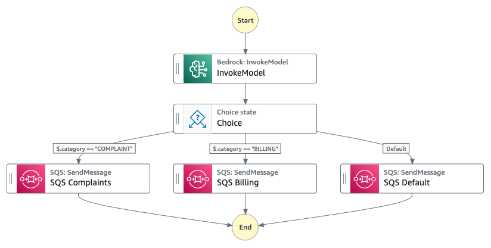

# Message categorizing with Amazon Bedrock and Amazon SQS

This workflow demonstrates how you can use Amazon Bedrock to categorize messages and then send them to an Amazon SQS queue for further processing. The AWS Serverless Application Model (SAM) template deploys the AWS Step Functions state machine which defines the workflow. 

Important: this application uses various AWS services and there are costs associated with these services after the Free Tier usage - please see the AWS Pricing page for details. You are responsible for any AWS costs incurred. No warranty is implied in this example.

## Requirements

- [Create an AWS account](https://portal.aws.amazon.com/gp/aws/developer/registration/index.html) if you do not already have one and log in. The IAM user or role that you use must have sufficient permissions to make the necessary AWS service calls and manage AWS resources.
- AWS CLI installed and configured
- [Git Installed](https://git-scm.com/book/en/v2/Getting-Started-Installing-Git)
- [AWS Serverless Application Model](https://docs.aws.amazon.com/serverless-application-model/latest/developerguide/serverless-sam-cli-install.html) (AWS SAM) installed
- NOTE! Manage Access to Amazon Bedrock Foundation Models at the time of writing, this example uses Amazon Bedrock foundation model anthropic.claude-3-haiku-20240307-v1:0

## Deployment Instructions

1. Create a new directory, navigate to that directory in a terminal and clone the GitHub repository:

```
git clone https://github.com/aws-samples/step-functions-workflows-collection
```

2. Change directory to the pattern directory:

```
cd categorization-state-machine
```

3. From the command line, use AWS SAM build to prepare an application for subsequent steps in the developer workflow, such as local testing or deploying to the AWS Cloud:

```
sam build
```

4. From the command line, use AWS SAM to deploy the AWS resources for the pattern as specified in the template.yml file:

```
sam deploy --guided
```
5. During the prompts:

- Enter a stack name
- Enter the desired AWS Region
- Allow SAM CLI to create IAM roles with the required permissions.

Once you have run `sam deploy --guided` once and saved arguments to a configuration file (for exmaple `samconfig.toml`), you can use `sam deploy` in future to use these defaults.

7. Note the outputs from the SAM deployment process. These contain the resource names and/or ARNs which are used for testing.

## How It Works

In this example, the state machine is invoked with a JSON payload, for example

```
{
  "message": "My unicorn is of the wrong colour"
}
```

Bedrock will then categorize the message and send it to the correct SQS queue for further processing (additional processing is not a part of this example).

## Architecture



## Testing

Manually invoke the Step Functions state machine either from the console or using the CLI. A successful execution will send the message to correct SQS queue that you can then use to further process the messages in your application.

## Cleanup

1. Delete the stack

```
sam delete
```

2. Confirm the stack has been deleted

```
aws cloudformation list-stacks --query "StackSummaries[?contains(StackName,'YOUR_STACK_NAME')].StackStatus"
```
