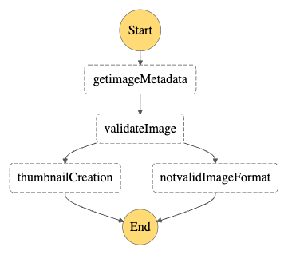

# Generate Thumbnail

This workflow demonstrates how to use Step Functions to generate thumbnail from image
Once you upload an image in the source bucket the workflow will get triggered and will generate a thumbnail from the image and save it to the resized bucket

Learn more about this workflow at Step Functions workflows collection: https://github.com/aws-samples/step-functions-workflows-collection/tree/main/generate-thumbnail

Important: this application uses various AWS services and there are costs associated with these services after the Free Tier usage - please see the [AWS Pricing page](https://aws.amazon.com/pricing/) for details. You are responsible for any AWS costs incurred. No warranty is implied in this example.

## Requirements

* [Create an AWS account](https://portal.aws.amazon.com/gp/aws/developer/registration/index.html) if you do not already have one and log in. The IAM user that you use must have sufficient permissions to make necessary AWS service calls and manage AWS resources.
* [AWS CLI](https://docs.aws.amazon.com/cli/latest/userguide/install-cliv2.html) installed and configured
* [Git Installed](https://git-scm.com/book/en/v2/Getting-Started-Installing-Git)
* [AWS Serverless Application Model](https://docs.aws.amazon.com/serverless-application-model/latest/developerguide/serverless-sam-cli-install.html) (AWS SAM) installed

## Deployment Instructions

1. Create a new directory, navigate to that directory in a terminal and clone the GitHub repository:
    ``` 
    git clone https://github.com/aws-samples/step-functions-workflows-collection
    ```
1. Change directory to the pattern directory:
    ```
    cd generate-thumbnail
    ```
1. From the command line, use AWS SAM to deploy the AWS resources for the workflow as specified in the template.yaml file:
    ```
    sam deploy --guided
    ```
1. During the prompts:
    * Enter a stack name
    * Enter the desired AWS Region
    * Allow SAM CLI to create IAM roles with the required permissions.

    Once you have run `sam deploy --guided` mode once and saved arguments to a configuration file (samconfig.toml), you can use `sam deploy` in future to use these defaults.

1. Note the outputs from the SAM deployment process. These contain the resource names and/or ARNs which are used for testing.

## How it works

The SAM template deploys the following state machine:



Once the Application is deployed you will have the below resources:

- Source S3 Bucket

- Resized S3 Bucket

- Event Bridge Rule

- Step Function State Machine

- Get Image Metadata Lambda Function

- Generate Thumbnail Lambda Function


Once a file is uploaded in the Source S3 Bucket, 

Object Created Event will be triggered and Event Bridge Rule will trigger the step function,

The first lmabda function will validate the image type (can be configured as enviroment variable ("Allowed_Types") with default value ("jpeg,png,jpg") that you can change to any ex:("jpeg,png")) and the function will also validate the image size that can also be configured as enviroment variable ("Max_Size") with default value ("700000") that you can change any time.

The flow will then move to the choice step which will decide if validations failed or not

If validations failed the step function will be marked as failed showing the error that it's invalid image type or size

If validation was successful the flow will continue to the next lambda function generate thumbnail which will generate a thumbnail from the image with default size (100 and 100) you can change the size using enviroment variables ("Height") and ("Width") and configure the needed size.


* Enviroment Variables:

getImageMetadata Lambda Function:

- Allowed_Types = jpeg,png,jpg

- Max_Size = 700000

generateThumbnail Lambda Function:

- Width = 100

- Height = 100

## Testing

Ensure that all resources are deployed successfully

Upload an image to the Source Bucket

Check the thumbnail created in the resized bucket


To test other scenarios:

Upload any file that is not (.jpg,.jpeg,.png) to the Source Bucket

Check the step function state and see the error message

## Cleanup
 
1. Delete the stack
    ```bash
    sam delete
    ```
1. Confirm the stack has been deleted
    ```bash
    aws cloudformation list-stacks --query "StackSummaries[?contains(StackName,'STACK_NAME')].StackStatus"
    ```
----
Copyright 2022 Amazon.com, Inc. or its affiliates. All Rights Reserved.

SPDX-License-Identifier: MIT-0