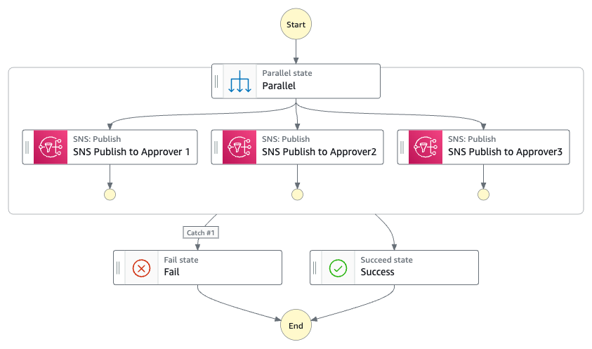

# Parallel Human Approval Process

There are some cases, in which approvals from multiple people are required to complete the whole process. In a parallel approval workflow, each person’s approval is individual and is needed separately. 

This pattern allows you to integrate parallel human approval process into your workflows. The task sends a message to three SNS topic which send a notification to a human reviewer or approver by email for example. The workflow then waits until the approver completes their review. Depending on the review outcome the workflow finishes.

Learn more about this workflow at Step Functions workflows collection: [Parallel Human Approval](https://serverlessland.com/workflows/parallel-human-approval)

Important: this application uses various AWS services and there are costs associated with these services after the Free Tier usage - please see the [AWS Pricing page](https://aws.amazon.com/pricing/) for details. You are responsible for any AWS costs incurred. No warranty is implied in this example.

Some examples:

* while onboarding of an employee, there might be many steps which needs to be run in parallel and independently with approvals from different people. 
* During the hiring process, there might be panel interview process and each interviewer enters their feedbacks independently and approve the hiring of interviewee or not.
* In the matrix organisations, there might be employees who report to multiple managers at the same time. While requesting a vacation, the approval request might be sent in parallel to multiple managers.


## Requirements

* [Create an AWS account](https://portal.aws.amazon.com/gp/aws/developer/registration/index.html) if you do not already have one and log in. The IAM user that you use must have sufficient permissions to make necessary AWS service calls and manage AWS resources.
* [AWS CLI](https://docs.aws.amazon.com/cli/latest/userguide/install-cliv2.html) installed and configured
* [Git Installed](https://git-scm.com/book/en/v2/Getting-Started-Installing-Git)
* [AWS Serverless Application Model](https://docs.aws.amazon.com/serverless-application-model/latest/developerguide/serverless-sam-cli-install.html) (AWS SAM) installed

## Deployment Instructions

1. Create a new directory, navigate to that directory in a terminal and clone the GitHub repository:
    ``` 
    git clone https://github.com/aws-samples/step-functions-workflows-collection
    ```
1. Change directory to the pattern directory:
    ```
    cd parallel-human-approval
    ```
1. From the command line, use AWS SAM to deploy the AWS resources for the workflow as specified in the template.yaml file:
    ```
    sam deploy --guided
    ```
1. During the prompts:
    * Enter a stack name
    * Enter the desired AWS Region
    * Allow SAM CLI to create IAM roles with the required permissions.
    * Enter email addresses that should receive the notifications from the workflow.

    Once you have run `sam deploy --guided` mode once and saved arguments to a configuration file (samconfig.toml), you can use `sam deploy` in future to use these defaults.

1. Note the outputs from the SAM deployment process. These contain the resource names and/or ARNs which are used for testing.

## How it works



1. Data that should be reviewed by multiple people is passed to the workflow. A message is send to a [Amazon Simple Notification Service (SNS)](https://aws.amazon.com/sns/) topic which sends out a notification via Email. The notification contains a [task token](https://docs.aws.amazon.com/step-functions/latest/dg/connect-to-resource.html#connect-wait-token) which is automatically generated by AWS Step Functions.
2. After approving or denying, the reviewer calls the `SendTaskSuccess` API and passes the task token as well as the review result. 
3. The result is evaluated by Step Functions.  

## Testing

1. After deployment the receivers receive an email titled `AWS Notification - Subscription Confirmation`. Click on the link in the email to confirm your subscription for each receiver. This will allow SNS to send the receivers emails.
2. Navigate to the AWS Step Functions console and select the `parallel-human-approval` workflow.
3. Select `Start Execution` and use any valid JSON data as input.
4. Select `Start Execution` and wait until the receivers receive the email from SNS.
5. Copy the task token from the email.
6. Use the AWS CLI to complete the task by calling the `SendTaskSuccess` API. Replace the task token with the value you copied earlier. 
    ```
   aws stepfunctions send-task-success --task-token <YOUR-TASK-TOKEN> --task-output '{"approver1response":"approved"}'
   aws stepfunctions send-task-success --task-token <YOUR-TASK-TOKEN> --task-output '{"approver2response":"approved"}'
   aws stepfunctions send-task-success --task-token <YOUR-TASK-TOKEN> --task-output '{"approver3response":"approved"}'
   ```
   Make sure to use that the cli uses the same region as the one you used to deploy your state machine.
5. Observe the task in the Step Functions console. Because response states that the approval was granted, the task transitioned to the `Process Approval` step.
6. If you trigger a new execution and execute the following command for one of the approver using AWS CLI in step 6, the workflow transitions to `Process Rejection` respectively.
      ```
      aws stepfunctions send-task-failure —task-token <YOUR-TASK-TOKEN>
      ```

## Cleanup
 
To delete the resources created by this template, use the following command:

```bash
sam delete
```

----
Copyright Amazon.com, Inc. or its affiliates. All Rights Reserved.

SPDX-License-Identifier: MIT-0
