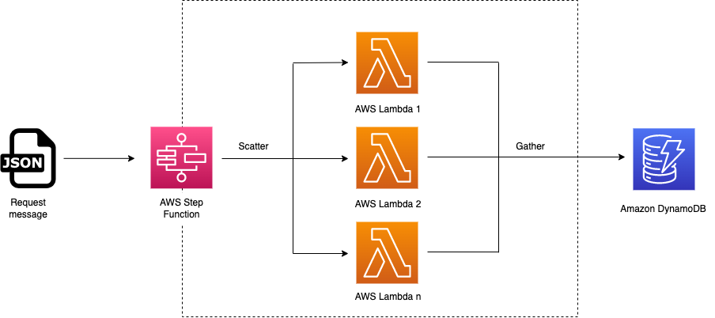
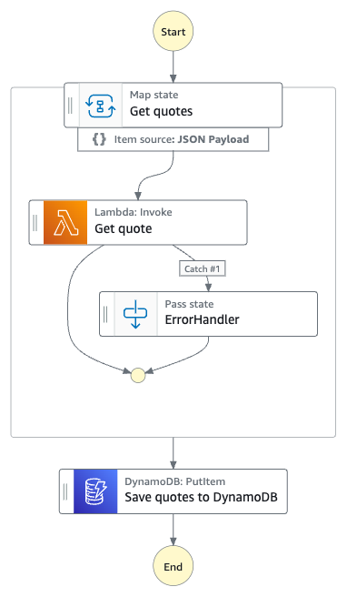

# Implement a Scatter-Gather pattern with a Map state and save the results to Amazon DynamoDB

This workflow demonstrates an implementation of the [Scatter-Gather pattern](https://www.enterpriseintegrationpatterns.com/patterns/messaging/BroadcastAggregate.html) using a Map state to call a set of Lambda functions. The Scatter-Gather pattern 'broadcasts' a request message to a set of responders, then aggregates the results. A typical use case would be getting a quotation for e.g. a flight from a number of different providers. In this case the responders are modelled as AWS Lambda functions.

The sample project creates the following:
* A user-specified number of **AWS Lambda functions** to respond to the request. For simplicity they all have the same implementation, but in practice they would differ.
* An **Amazon DynamoDB** table to store the aggregated result.
* An **AWS Step Functions** state machine that uses a Map state to implement the Scatter-Gather pattern.

Conceptually this looks like this:


**Important:** this application uses various AWS services and there are costs associated with these services after the Free Tier usage - please see the [AWS Pricing page](https://aws.amazon.com/pricing/) for details. You are responsible for any AWS costs incurred. No warranty is implied in this example.

## Requirements

* [Create an AWS account](https://portal.aws.amazon.com/gp/aws/developer/registration/index.html) if you do not already have one and log in. The IAM user that you use must have sufficient permissions to make necessary AWS service calls and manage AWS resources.
* [AWS CLI](https://docs.aws.amazon.com/cli/latest/userguide/install-cliv2.html) installed and configured
* [Git Installed](https://git-scm.com/book/en/v2/Getting-Started-Installing-Git)
* [AWS CDK Installed](https://docs.aws.amazon.com/cdk/v2/guide/getting_started.html#getting_started_install)

## Deployment Instructions

1. If this is your first time using AWS CDK, bootstrap your [environment](https://docs.aws.amazon.com/cdk/v2/guide/getting_started.html#getting_started_bootstrap).
    ```
    cdk bootstrap aws://{your-aws-account-number}/{your-aws-region} 
    ```
2. Create a new directory, navigate to that directory in a terminal and clone the GitHub repository:
    ``` 
    git clone https://github.com/aws-samples/step-functions-workflows-collection
    ```
3. Change directory to the pattern directory:
    ```
    cd scatter-gather
    ```
4. From the command line, use npm to install dependencies and run the build process for the Lambda functions.:
    ```
    npm install
    npm run build
    ```
5. From the command line, use CDK to deploy the AWS resources for the workflow.
    ```
    cdk deploy
    ```
6. During the prompts:
    ```
    Do you wish to deploy these changes (y/n)? Y
    ```
7. The output from the cdk deployment process includes a sample test request with a machine-generated list of the AWS Lambda functions that have been deployed.

## How it works

1. When the state machine is executed, it will invoke a 'recipient list' of AWS Lambda functions (specified in the request message) passing in the request details.
2. The response from each AWS Lambda function will be aggregated into a single message that illustrates the various 'quotes' that were received for the request. 
3. The aggregated response will be stored in an Amazon DynamoDB table. 

## Image


## Testing
1. Copy the sample JSON request created as output from the deployment. It consists of a description of the request, and a list of the AWS Lambda functions that will be called.
2. In the AWS Console, navigate to Step Functions and open the state machine that has just been deployed.
3. Click on Start Execution and in the 'Input - optional' box on the **Start Execution** page, paste the sample JSON message.
4. Click **Start Execution**.

* To check the DynamoDB table, navigate to the Amazon DynamoDB console and choose the table created by the CDK template.
* Choose **Explore table items**.
* Under **Items returned** you should see the aggregated response from the AWS Lambda functions.


## Cleanup
 
1. Delete the stack
    ```bash
    cdk destroy
    ```
1. During the prompts:
    ```bash
        Are you sure you want to delete: ScatterGatherCdkStack (y/n)? Y
    ```
----
Copyright 2023 Amazon.com, Inc. or its affiliates. All Rights Reserved.

SPDX-License-Identifier: MIT-0
