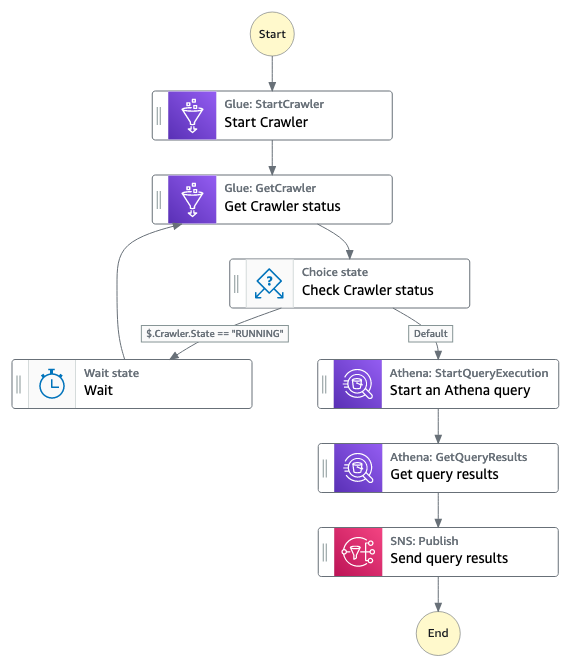

# Query large datasets (Amazon Athena, Amazon S3, AWS Glue, Amazon SNS)

**Resources used**  

| Resource Type | Name    |
|------------------|--------------------|
| Athena Workgroup | AthenaWorkgroup    |
| State Machine    | AthenaStateMachine |
| SNS Topic        | SNSTopic           |
| S3 Bucket        | DataBucket         |
| Glue Database    | GlueDatabase       |
| Glue Crawler     | GlueCrawler        |  
  
## Start an Athena query

This workflow demonstrates how to ingest a large data set in Amazon S3 and partition it through AWS Glue Crawlers, then execute Amazon Athena queries against that partition. Deploying this sample project creates an AWS Step Functions state machine, an Amazon S3 Bucket, an AWS Glue crawler, and an Amazon SNS topic.

In this project, the Step Functions state machine invokes an AWS Glue crawler that partitions a large dataset in Amazon S3. Once the AWS Glue crawler returns a success message, the workflow executes Athena queries against that partition. Once query execution is successfully complete, a notification is sent to an Amazon SNS topic.

* An Amazon Athena query
* An AWS Glue crawler
* AWS Lambda Functions
* An Amazon Simple Notification Service topic
* Related AWS Identity and Access Management (IAM) roles

Learn more about this workflow at Step Functions workflows collection: https://docs.aws.amazon.com/step-functions/latest/dg/sample-query-large-datasets.html

Important: this application uses various AWS services and there are costs associated with these services after the Free Tier usage - please see the [AWS Pricing page](https://aws.amazon.com/pricing/) for details. You are responsible for any AWS costs incurred. No warranty is implied in this example.

## Requirements

* [Create an AWS account](https://portal.aws.amazon.com/gp/aws/developer/registration/index.html) if you do not already have one and log in. The IAM user that you use must have sufficient permissions to make necessary AWS service calls and manage AWS resources.
* [AWS CLI](https://docs.aws.amazon.com/cli/latest/userguide/install-cliv2.html) installed and configured
* [Git Installed](https://git-scm.com/book/en/v2/Getting-Started-Installing-Git)
* [AWS Serverless Application Model CLI](https://docs.aws.amazon.com/serverless-application-model/latest/developerguide/serverless-sam-cli-install.html) (AWS SAM CLI) installed

## Deployment Instructions

1. Create a new directory, navigate to that directory in a terminal and clone the GitHub repository:
    ``` 
    git clone https://github.com/aws-samples/step-functions-workflows-collection
    ```
3. Change directory to the pattern directory:
    ```
    cd sfn-query-large-datasets-sam
    ```
4. From the command line, use AWS SAM CLI to deploy the AWS resources for the workflow as specified in the template.yaml file:
    ```
    sam deploy --guided
    ```
5. During the prompts:
    * Enter a stack name
    * Enter the desired AWS Region
    * Allow SAM CLI to create IAM roles with the required permissions.

    Once you have run `sam deploy --guided` mode once and saved arguments to a configuration file (samconfig.toml), you can use `sam deploy` in future to use these defaults.

6. Note the outputs from the SAM deployment process (also visible in CloudFormation Stack details). These contain the resource names and/or ARNs which are used for testing:

    * ```GlueCrawler```: Name of the Glue Crawler which is used.
    * ```BucketName```: Name of the bucket which is used for the Glue Database.
    * ```SfnStateMachine```:  ARN of the Step Functions State Machine orchestrating the process.

## How it works

The workflow starts by initializing a state machine, and the first task in the sequence is to ingest a large data set in Amazon S3 and partition it through aws Glue Crawlers.

The Athena query is then initiated and runs until it is completed.

Once the query is completed, the results are obtained and published to the SNS (Simple Notification Service) topic. Amazon SNS is a managed service that allows users to send notifications from the cloud to various subscribers or endpoints, such as email, SMS, or mobile push notifications.

## Image



## Testing


Manually trigger the workflow via the Console or the AWS CLI.  The state machine ARN can be found as the ```state_machine_arn``` CloudFormation output and the state machine name can be found as ```state_machine_name``` in the CloudFormation output.

To trigger the workflow in the console, navigate to Step Functions and then click the step function name from the list of State Machines.  In the Executions panel, click Start Execution.  Click Start Execution again in the popup (default input values can be ignored).

## Cleanup
 
1. Delete the stack
    ```bash
    sam delete
    ```
2. During the prompts:
    ```bash
    Are you sure you want to delete the stack <yourStackName> in the region <yourRegion> ?

    Enter a value: y
    ```
    ```bash
    Are you sure you want to delete the folder test in S3 which contains the artifacts? ?

    Enter a value: y
    ```

## Want more?

Check out more workflows on [ServerlessLand](https://serverlessland.com/workflows).
  
----

Copyright 2023 Amazon.com, Inc. or its affiliates. All Rights Reserved.

SPDX-License-Identifier: MIT-0